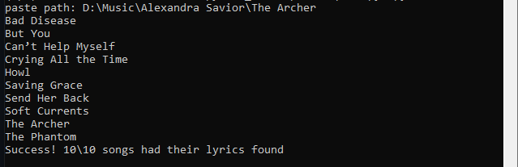

# mp3_genius_lyrics_finder_py
Given a directory, this script scrapes lyrics from Genius.com and creates a .txt file containing the lyrics. More info can be found in comments in the [Python file](subtitle_finder.py)

Step 1:

Copy the path to the directory which holds the mp3 files:

Step 2:

Run the script in the command line and paste in the copied path

Step 3:

All being well, the directory should now contain a bunch of .txt files which have names corresponding to each .mp3. They should contain the correct lyrics, too!

NOTE:

This is made to work with the way that I store my MP3s so if your way of organising your music is different, this will probably run into a lot of snags. It doesn't cope with special characters, for instance, and relies on your MP3 files having their properties (artist, album_artist, title) acurately filled in. It can be improved in a lot of ways, but works okay for me for now!
